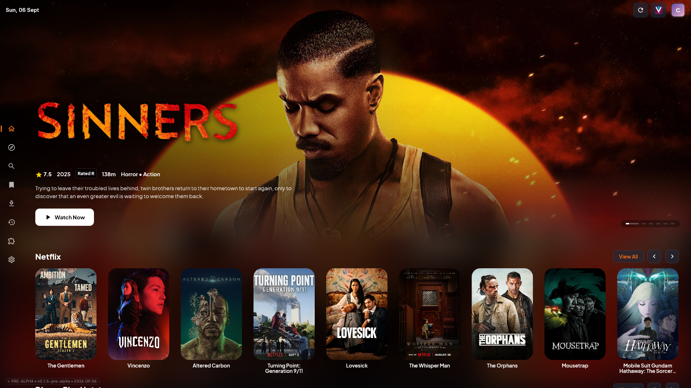
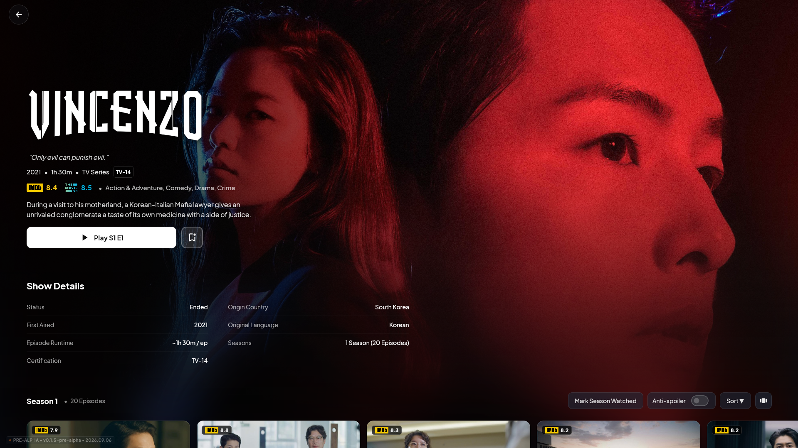
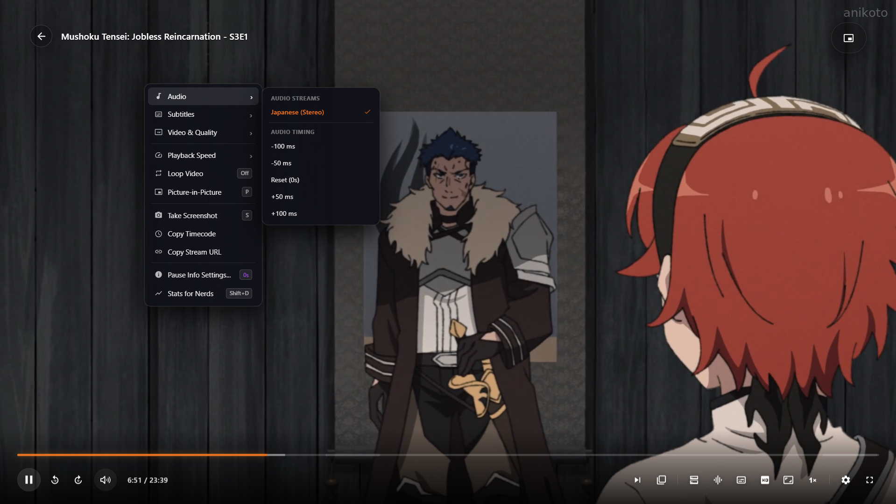
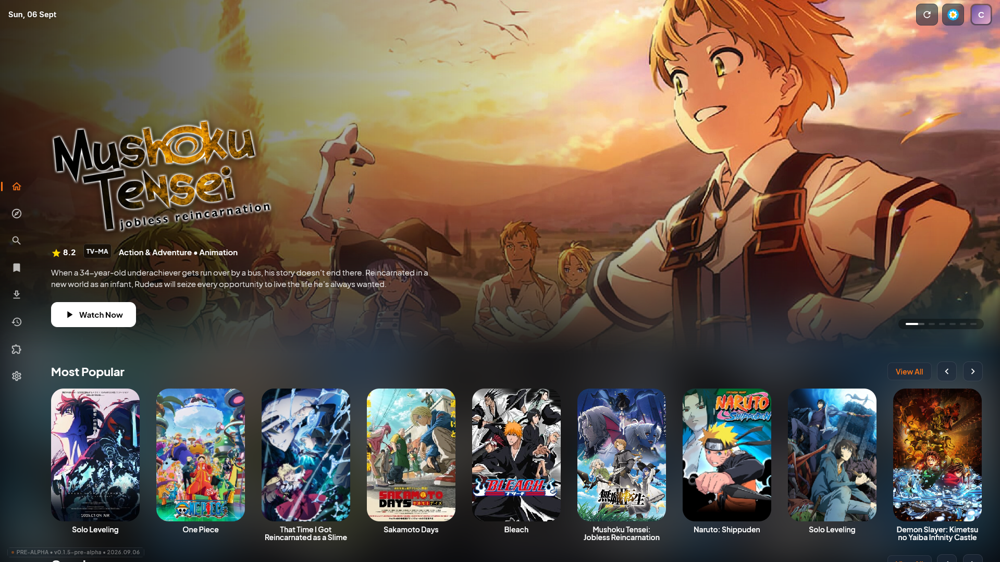

# CloudStream Desktop (Unofficial Client)

Desktop-native streaming client built with **Compose Multiplatform** for 64-bit Windows. Runs Android CloudStream extensions natively on a desktop JVM without requiring emulators or compatibility layers.

> [!IMPORTANT]
> **Project Scope & Architecture Directives**
> * **Desktop-Exclusive Hard Fork:** This repository is built exclusively for 64-bit Windows desktop. It is an independent hard fork and does not merge upstream into Android CloudStream.
> * **Zero Affiliation:** This project is independent and unaffiliated with the original Android CloudStream application or its development team. Please do not contact upstream developers regarding this client.
> * **Ad-Free Policy:** Strict ad-free project. Derivative builds and forks must remain clean, free, and open.

---

## Interface Preview

| Home Spotlight & Banner | Media Details & Episode Browser |
| :---: | :---: |
|  |  |
| **Hardware-Accelerated MPV Player** | **Catalog & Discovery** |
|  |  |

---

## Architectural Overview

The application is structured into modular subprojects separating platform abstraction, runtime transcompilation, and UI presentation:

| Module | Responsibility |
| :--- | :--- |
| **`:desktop-app`** | Compose Multiplatform presentation layer, Amoled dark theme, local stream proxy, and native desktop window controls. |
| **`:plugin-runtime`** | Transcompilation engine. Converts Dalvik DEX bytecode into JVM bytecode via Dex2jar, applies ASM bytecode instrumentation, and enforces sandbox security policies. |
| **`:player-abstraction`** | JNA bindings to the native `libmpv` C-core for hardware-accelerated video decoding. |
| **`:android-stubs`** | Stubs for Android platform APIs (`Context`, `SharedPreferences`, `Build`, `DisplayMetrics`) allowing Android extension bytecode to run on the JVM. |
| **`:common`** | SQLite persistence layer powered by **SQLDelight** for local history, preferences, and state management. |
| **`:library`** | Base CloudStream contracts and core provider interfaces. |

---

## Developer Setup & Quick Start

### Prerequisites
* **Operating System:** Windows 10 / 11 (64-bit)
* **Java Development Kit:** **JDK 21** or higher (e.g. [Eclipse Adoptium Temurin 21](https://adoptium.net/temurin/releases/?version=21))
* **Git:** Installed and available in PATH

---

### Step 1: Clone With Submodules
This repository relies on internal submodules. You **must** clone recursively:

```bash
git clone --recursive https://github.com/errorcode26/CS3-desktop-client-unofficial.git
cd CS3-desktop-client-unofficial
```

*(If you already cloned without `--recursive`, run `git submodule update --init --recursive` inside the repository).*

---

### Step 2: Native Binaries Setup (MPV)
The video player requires the 64-bit native `libmpv-2.dll` placed in `desktop-app/appResources/windows/mpv/`.

Because `libmpv-2.dll` (~112 MB) exceeds GitHub's 100 MB single-file repository limit, it is not bundled directly in git.

**How to get `libmpv-2.dll`:**
1. Download the `mpv-dev-x86_64-*.7z` development package from [shinchiro/mpv-winbuild-cmake releases](https://github.com/shinchiro/mpv-winbuild-cmake/releases) (such as pinned build [20260610](https://github.com/shinchiro/mpv-winbuild-cmake/releases/tag/20260610)).
2. Extract `libmpv-2.dll` from the downloaded archive.
3. Place `libmpv-2.dll` into:

```text
desktop-app/
└── appResources/
    └── windows/
        ├── mpv/
        │   ├── libmpv-2.dll          <-- Place extracted DLL here
        │   └── portable_config/
        │       └── mpv.conf
        └── jni/
            ├── player_bridge.dll     <-- Pre-bundled in repository
            └── WebView2Loader.dll    <-- Pre-bundled in repository
```

---

### Step 3: Run & Build

Use the interactive launcher script:

```bat
.\launch.bat
```

The launcher provides quick shortcuts:
* `.\launch.bat dev` — Start the client with Live LogCat (F12) enabled.
* `.\launch.bat release` — Launch the compiled standalone executable.
* `.\launch.bat build` — Compile the standalone distribution EXE via Gradle.
* `.\launch.bat test` — Run all module test suites and compile checks.

Alternatively, execute tasks directly via Gradle:
```bat
# Run in dev mode
.\gradlew.bat :desktop-app:run --args="--dev"

# Compile standalone distributable
.\gradlew.bat :desktop-app:createDistributable
```

---

## Disclaimer

This software is an empty media player shell and runtime harness. It does not host, distribute, or bundle any media content, streams, or scrapers. Users are solely responsible for extensions they choose to install.
